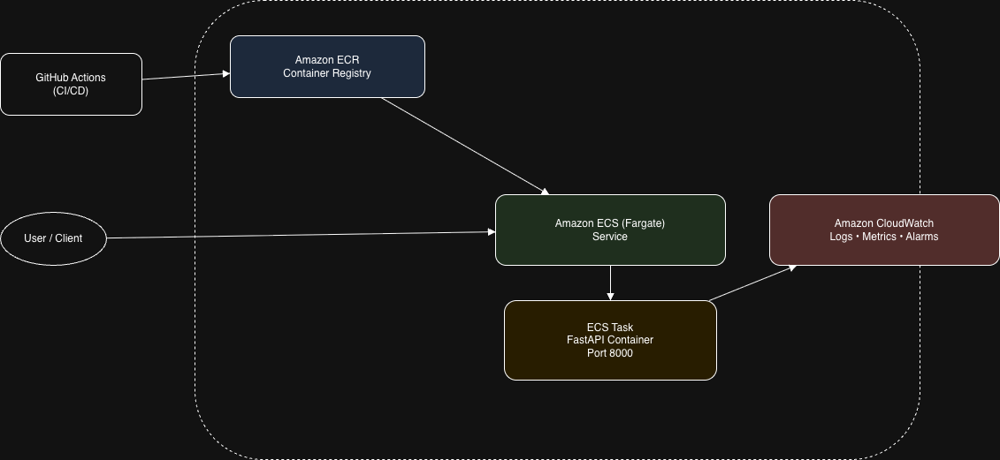

# Predict API – DevOps Assignment

This repository contains a small API service deployed on AWS.
The purpose of this project is to show how I approach containerization, CI/CD, infrastructure setup, monitoring, and security for a simple backend service.

The focus here is on clean automation and sensible defaults rather than application complexity.

---

## Architecture Diagram



---

## What This Project Does

The application is a minimal FastAPI service with two endpoints:

| Method | Endpoint | Purpose |
|------|---------|---------|
| GET | /health | Health check |
| GET | /predict | Returns a static score |

Example response:
```json
{
  "score": 0.75
}
```

---

## Architecture Overview

At a high level, the flow looks like this:

- Code is pushed to GitHub
- GitHub Actions builds a Docker image
- The image is pushed to Amazon ECR
- Amazon ECS (Fargate) pulls the image and runs the service
- Logs, metrics, and alarms are handled by CloudWatch

The service runs on ECS Fargate, so there are no servers to manage.

---

## CI/CD Pipeline

CI/CD is implemented using GitHub Actions and runs on every push to the main branch.

### CI
- Checkout the code
- Build the Docker image
- Authenticate to AWS using OIDC (no access keys)
- Push the image to Amazon ECR

### CD
- Trigger a new ECS deployment
- ECS performs a rolling update to keep the service available

Terraform is used only for infrastructure changes.
Application deployments are handled entirely by the pipeline.

---

## Deployment Details

- ECS Fargate service with 2 running tasks
- Rolling deployments enabled
- Container runs as a non-root user
- Application listens on port 8000

This setup keeps deployments simple and avoids managing EC2 instances.

---

## Security Notes

- IAM permissions follow least-privilege principles
- GitHub Actions authenticates to AWS using OIDC
- No AWS credentials are stored in the repository
- Secrets are not hardcoded
- Networking is controlled using security groups

---

## Monitoring

Monitoring is configured using CloudWatch and defined through Terraform.

### Logs
- Container logs are sent to CloudWatch Logs
- Log retention is configured

### Metrics
- ECS CPU utilization
- ECS memory utilization
- Running task count

### Alerts
- Alarm when CPU usage crosses a threshold
- Alarm when the number of running tasks drops below expected

---

## Infrastructure as Code

All infrastructure is created using Terraform, including:

- ECS cluster and service
- Task definition
- ECR repository
- Security groups and networking
- CloudWatch dashboards and alarms

This makes the setup repeatable and easy to recreate.

---

## How to Run It

### Prerequisites
- AWS account
- AWS CLI configured locally
- Terraform installed
- GitHub Actions enabled for the repository

### Steps
1. Provision infrastructure:
   ```bash
   terraform init
   terraform apply
   ```
2. Push code to the main branch
3. GitHub Actions builds and deploys the service automatically

---

## Submission Material

The submission includes:
- GitHub repository link
- Successful GitHub Actions run
- ECS service showing running tasks
- CloudWatch dashboard
- CloudWatch alarms

---

## Author

Kushagra
